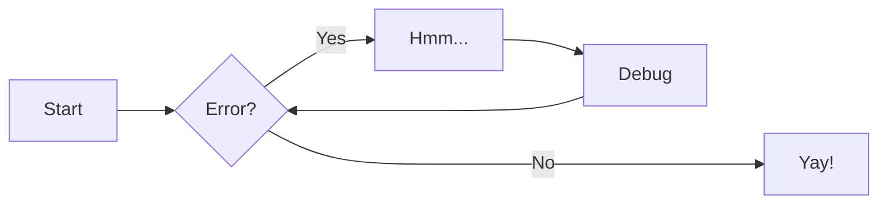
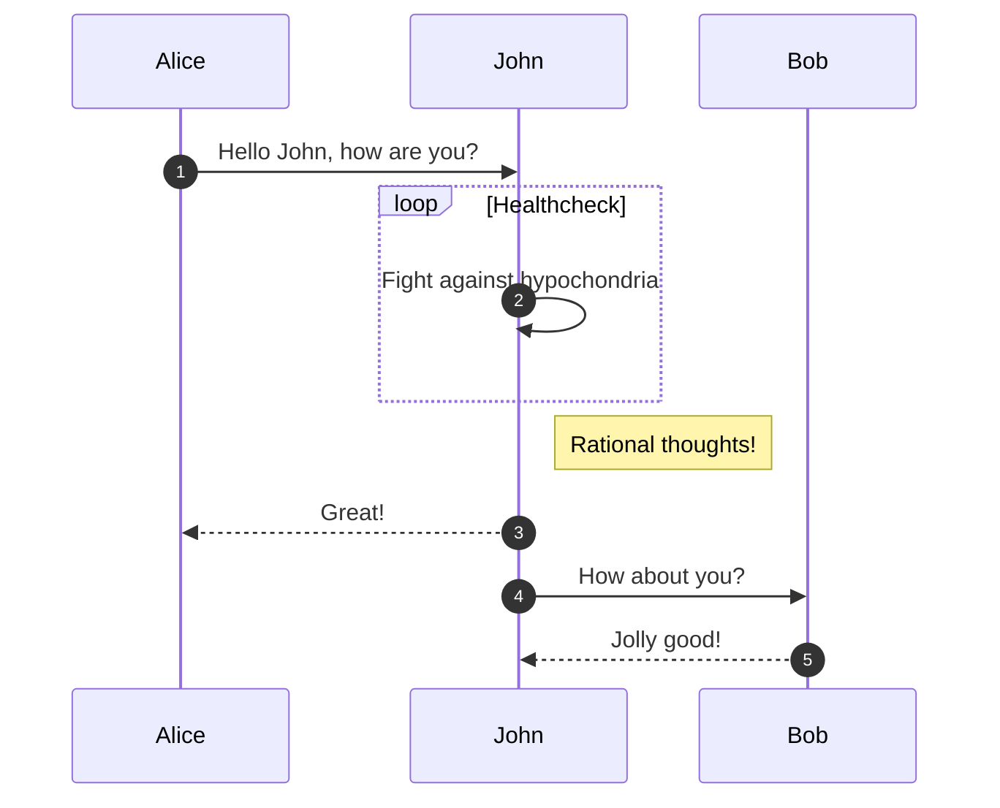
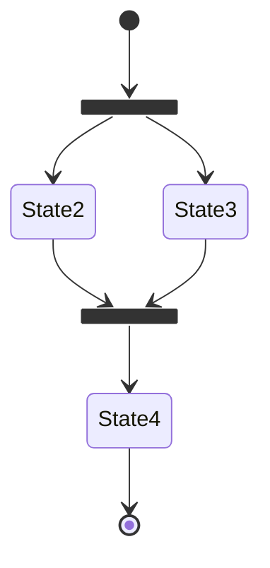
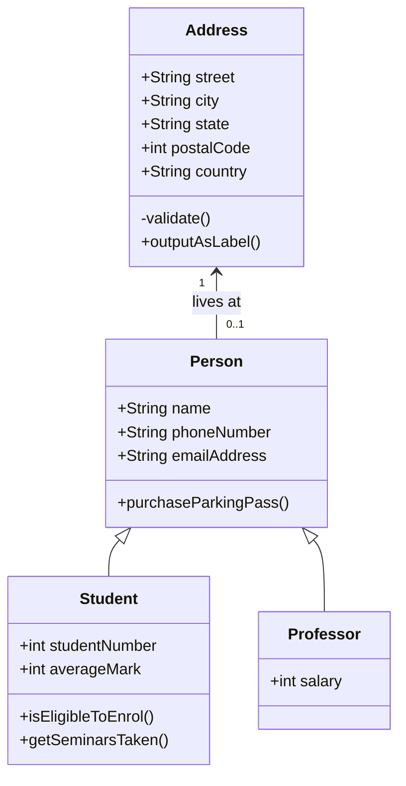
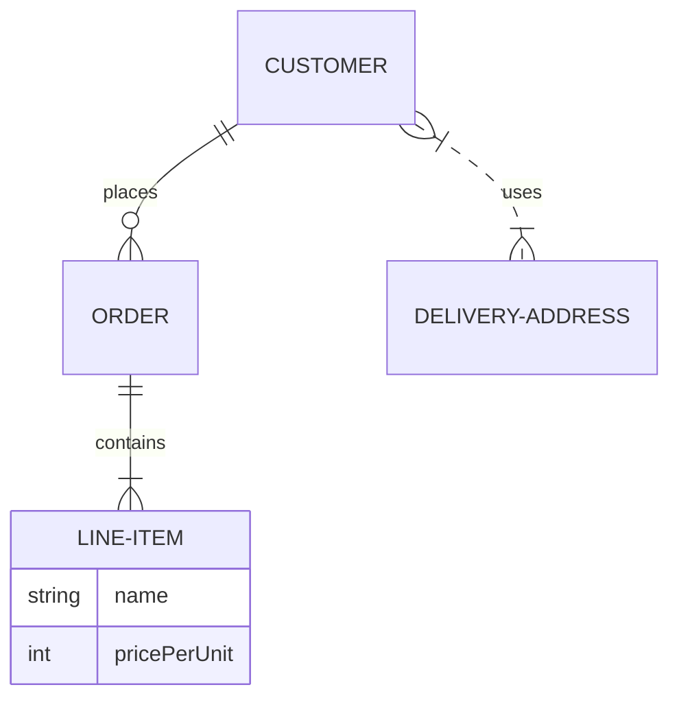

# Tools

### Guide

[https://squidfunk.github.io/mkdocs-material/reference/](https://squidfunk.github.io/mkdocs-material/reference/)

## Math

$$
L \space \{f(t)\} = \int_{o^-}^{\infty}{f(x) e^{-st} dt} = F(s)
$$

$$
L^{-1}\space = \{ F(s)\} = \frac{1}{2\pi i} \lim_{T \to \infty} \int_{\gamma-iT}^{\gamma+iT} {e^{sT} F(s) ds} = f(t)
$$

$$
T(n) =
 \begin{cases}     \text{Theta } 1      & \quad \text{if } n = 0
 \\ a*T\frac{n}{b} + O(n^k)  & \quad \text{if } n > 0
 \end{cases}
$$

## Coding

```c title="Heap Sort" linenums="1"
h.A = A; //New Heap
h.size = A.lenght;
Build_Max_Heap(h); //make a heap from an array
for( i = h.A.length-1; i > 1 ; i--) {
  exchange_slots(A,0,i);
  h.size = h.size – 1;
  Max-heapify(h,0); //make node i the highest priority of the sub tree
}
```

```py title="Main.py" hl_lines="2 3"
if __name__ == "__main__":
    just_fix_windows_console() #it’s safe to call this function on non-Windows platforms
    CoreLogic()
```

## Content Tabs

=== "Seiun Sky"

    Etiam eleifend dictum erat. Etiam vel felis vitae turpis aliquet feugiat. Proin vel ex arcu. Sed quis nulla interdum, mollis lorem vitae, euismod tortor. Sed a odio ligula. Curabitur finibus pellentesque purus, vel feugiat dui. Suspendisse potenti.

=== "A"

    - No time to lose.
    * I'm trying to figure out a way to get rid of you so I can go commit atrocities. ...Wait, did you think I was being serious?

=== "B"

    1. Da-da-da~
    1. Lalala~

=== "C"

    ``` c
    #include <stdio.h>

    int main(void) {
      printf("Oguri Cap!\n");
      return 0;
    }
    ```

=== "C++"

    ``` c++
    #include <iostream>

    int main(void) {
      std::cout << "Maruzensky!" << std::endl;
      return 0;
    }
    ```

## Admonitions

??? example "Collassabile"

    Lorem ipsum

    ???+ note "Outer Note"

        dolor

        ??? note "Inner Note"

            sit amet

??? example "Inline examples"

    !!! info inline "Inline"

    !!! info inline end "Inline End"

!!! note ""

    No title

??? tip "All types"

    !!! note
    !!! abstract
    !!! info
    !!! tip
    !!! success
    !!! question
    !!! warning
    !!! failure
    !!! danger
    !!! bug
    !!! example
    !!! quote

## Annotations

=== "Base"

    ```
    A golden chest on the horizon, everyone amazed. (1)
    { .annotate }

    1. This look shiny!
    ```

    A golden chest on the horizon, everyone amazed. (1)
    { .annotate }

    1. This look shiny!

=== "Inside Admonitions"

    !!! note annotate "Exampleeee! (1)"

        Is time to gamble! (2) Again!

    1.  :thumbs_up: I'm an annotation!
    2.  :thumbs_up: I'm an annotation as well!

=== "HTML"

    <div class="annotate" markdown>
    > A golden chest on the horizon, everyone amazed. (1)
    </div>

    1.  This look like not a coding language!

=== "Code"

    ``` yaml
    title: "Example" # (1)!
    ```

    1.  Look ma, less line noise!

## Buttons

[Button + Emoji :material-emoticon:](#){ .md-button }

[Button](#){ .md-button .md-button--primary }

## Data tables

|  Method  | Description                          |
| :------: | :----------------------------------- |
|  `GET`   | :material-check: Fetch resource      |
|  `PUT`   | :material-check-all: Update resource |
| `DELETE` | :material-close: Delete resource     |

## Diagrams

### Flowcharts



### Sequence Diagrams



### State Diagrams



### Class Diagrams



### Entity-Relationship Diagrams



### [Extras](https://squidfunk.github.io/mkdocs-material/reference/diagrams/#other-diagram-types)

Pie charts, Gantt Charts, User Journeys, Git Graphs and Requirement Diagrams

### [ELK layouts](https://squidfunk.github.io/mkdocs-material/reference/diagrams/#customization)

## Footnotes

!!! danger ""

    Sponsors only

## Formatting

Text can be {--deleted--} and replacement text {++added++}. This can also be
combined into {~~one~>a single~~} operation. {==Highlighting==} is also
possible {>>and comments can be added inline<<}.

{==

Formatting can also be applied to blocks by putting the opening and closing
tags on separate lines and adding new lines between the tags and the content.

==}

### Highlighting text

- ==This was marked (highlight)==
- ^^This was inserted (underline)^^
- ~~This was deleted (strikethrough)~~

### Sub- and superscripts

- H~2~O
- A^T^A

### keyboard keys

++ctrl+alt+del++

## Grids

### Card Grids

<div class="grid cards" markdown>

- :fontawesome-brands-html5: **HTML** for content and structure
- :fontawesome-brands-js: **JavaScript** for interactivity
- :fontawesome-brands-css3: **CSS** for text running out of boxes
- :fontawesome-brands-internet-explorer: **Internet Explorer** ... huh?

</div>

### Card grid, complex example ([Hide the bars](https://squidfunk.github.io/mkdocs-material/setup/setting-up-navigation/#hiding-the-sidebars))

<div class="grid cards" markdown>

- :material-clock-fast:{ .lg .middle } **Set up in 5 minutes**

      ***

      Install [`mkdocs-material`](#) with [`pip`](#) and get up
      and running in minutes

      [:octicons-arrow-right-24: Getting started](#)

- :fontawesome-brands-markdown:{ .lg .middle } **It's just Markdown**

      ***

      Focus on your content and generate a responsive and searchable static site

      [:octicons-arrow-right-24: Reference](#)

- :material-format-font:{ .lg .middle } **Made to measure**

      ***

      Change the colors, fonts, language, icons, logo and more with a few lines

      [:octicons-arrow-right-24: Customization](#)

- :material-scale-balance:{ .lg .middle } **Open Source, MIT**

      ***

      Material for MkDocs is licensed under MIT and available on [GitHub]

      [:octicons-arrow-right-24: License](#)

</div>

### Block syntax

<div class="grid" markdown>

:fontawesome-brands-html5: **HTML** for content and structure
{ .card }

:fontawesome-brands-js: **JavaScript** for interactivity
{ .card }

:fontawesome-brands-css3: **CSS** for text running out of boxes
{ .card }

> :fontawesome-brands-internet-explorer: **Internet Explorer** ... huh?

</div>

### Generic Grids

<div class="grid" markdown>

=== "Unordered list"

    * Sed sagittis eleifend rutrum
    * Donec vitae suscipit est
    * Nulla tempor lobortis orci

=== "Ordered list"

    1. Sed sagittis eleifend rutrum
    2. Donec vitae suscipit est
    3. Nulla tempor lobortis orci

```title="Content tabs"
=== "Unordered list"

    * Sed sagittis eleifend rutrum
    * Donec vitae suscipit est
    * Nulla tempor lobortis orci

=== "Ordered list"

    1. Sed sagittis eleifend rutrum
    2. Donec vitae suscipit est
    3. Nulla tempor lobortis orci
```

</div>

## [Icons, Emojis](https://squidfunk.github.io/mkdocs-material/reference/icons-emojis/#icons-emojis)

### Colors

### Animations

## [Images](https://squidfunk.github.io/mkdocs-material/reference/images/#images)

- Lazy loading
- Alignment
- Captions
- Light and dark mode

## Lists

- Unordered lists can be written by prefixing a line with a `-`, `*` or `+` list marker, all of which can be used interchangeably.
- Ordered lists must start with a number immediately followed by a dot. The numbers do not need to be consecutive and can be all set to `1.`
- When Definition Lists is enabled, lists of arbitrary key-value pairs

      `Lorem ipsum dolor sit amet`

      : Sed sagittis eleifend rutrum. Donec vitae suscipit est. Nullam tempus
      tellus non sem sollicitudin, quis rutrum leo facilisis.

- When Tasklist is enabled, unordered list items can be prefixed with [ ] to render an unchecked checkbox or [x] to render a checked checkbox

  - [x] Lorem ipsum dolor sit amet, consectetur adipiscing elit
  - [ ] Vestibulum convallis sit amet nisi a tincidunt
    - [x] In hac habitasse platea dictumst
    - [x] In scelerisque nibh non dolor mollis congue sed et metus
    - [ ] Praesent sed risus massa
  - [ ] Aenean pretium efficitur erat, donec pharetra, ligula non scelerisque

## Tooltips

=== "inline syntax"

    ```yaml title="Link with tooltip, inline syntax"
    [Hover me](https://github.com/ "I'm a tooltip!") # idk https://example.com
    ```
    [Hover me](https://github.com/ "I'm a tooltip!")

=== "reference syntax"

    ```yaml title="Link with tooltip, reference syntax"
    [Hover me][example]

      [example]: https://github.com/ "I'm a tooltip!" # idk https://example.com
    ```
    [Hover me][example]

      [example]: https://github.com/ "I'm a tooltip!"

=== "Emoji syntax"

    ```
    :material-information-outline:{ title="Important information" }
    ```
    :material-information-outline:{ title="Important information" }

=== "Abbreviations"

    ```
    The HTML specification is maintained by the W3C.

    [HTML]: Hyper Text Markup Language
    [W3C]: World Wide Web Consortium
    ```

    The HTML specification is maintained by the W3C.

    *[HTML]: Hyper Text Markup Language

    *[W3C]: World Wide Web Consortium

    [Adding a glossary](https://squidfunk.github.io/mkdocs-material/reference/tooltips/#adding-a-glossary)
